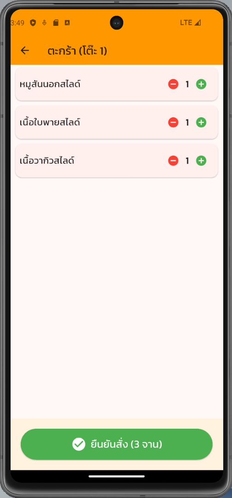
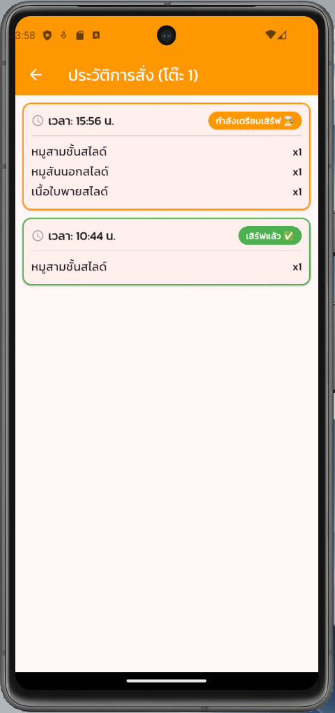
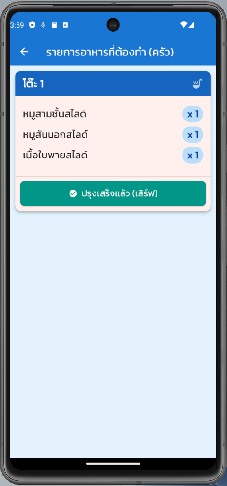
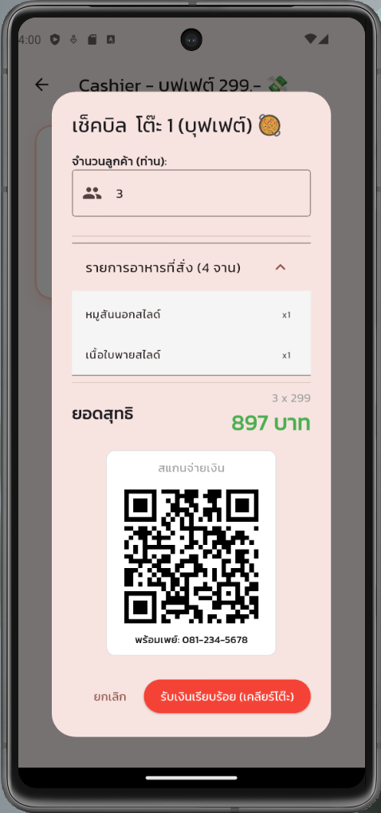

# 🥘 Shabu Umami 

A comprehensive **Point of Sale (POS) & Restaurant Management System** designed specifically for buffet restaurants. Built with **Flutter** and powered by **Firebase**, this application streamlines the entire dining process from self-ordering at the table to real-time kitchen updates and cashless payment.

## 📱 Project Overview

This project simulates a real-world scenario of a Shabu/Hotpot buffet restaurant. It solves common pain points such as delayed orders, communication errors between the dining hall and the kitchen, and slow billing processes.

## Key Features

* **🛒 Self-Service Ordering:** Customers can browse the digital menu and place orders directly from their table via a tablet interface.
* **👨‍🍳 Real-time Kitchen Monitor (KDS):** Orders appear instantly on the kitchen screen using Firebase Streams, allowing chefs to prepare food without paper tickets.
* **⚡ Instant Sync:** Status updates (Ordering -> Cooking -> Served) are synchronized across all devices in real-time.
* **💸 Smart Billing & QR Payment:**
    * Automatic buffet price calculation based on the number of customers (Headcount).
    * **Dynamic PromptPay QR Code Generation:** Generates a scannable QR code for cashless payment based on the total bill amount.
* **📊 Table Management:** System to open tables, track active orders, and clear tables after payment.

## 🛠 Tech Stack

| Component | Technology |
| :--- | :--- |
| **Framework** | Flutter (Dart) |
| **Backend / DB** | Firebase (Cloud Firestore) |
| **State Management** | `setState` & `StreamBuilder` (Real-time data flow) |
| **Key Packages** | `cloud_firestore` (Database), `qr_flutter` (Payment Gen) |

## 📸 Screenshots

<p align="center">
  
</p>

<p align="center">
  
  
  
  
  
</p>

## 🚀 How to Run

1.  **Clone the repository**
    ```bash
    git clone https://github.com/WuttikornFunk/Shabu_Umami.git
    cd Shabu_Umami
    ```
    
2.  **Install dependencies**
    ```bash
    flutter pub get
    ```
    
3.  **Firebase Setup**
    * This project uses Firebase. You need to add your own `google-services.json` file inside `android/app/`.
      
4.  **Run the App**
    Select your target device (Emulator or Physical Device) and run:
    ```bash
    flutter run
    ```


---
**Developed by [Wuttikorn Jantawises]**
